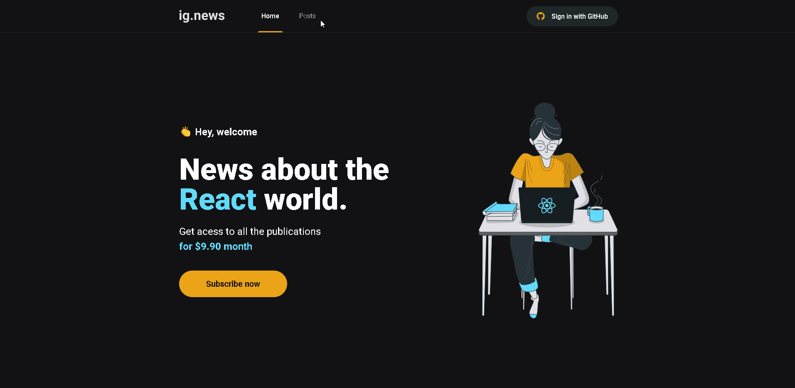

<h1 align="center">
  
</h1>

## **<h2 align="center">Front end application  💻</h2>**

## 
<h2 align="center">Blog application developed in Ignite's third module delivered by [Rocketseat](https://app.rocketseat.com.br/dashboard)</h2> 

# **Demonstration of the application** 💻

  

 

## Features
- Login with GitHub 
- Subscribe to the blog through recurring payment 
- View partial blog posts if you're not logged in or have an active subscription
- View full blog posts if logged in and with an active subscription

## 🚀 Technologies used:

 

## 💻 Application installation
- `git clone https://github.com/mathwcruz/ignite-reactjs-chapter_III-ignews.git` to clone the repository

 

# Run application
To run the application on the web, follow the instructions from your terminal:
- `cd ignite-reactjs-chapter_III-ignews` and `code .`
- run `yarn` to install the dependencies of the project
- After that, run `yarn dev` to run the application, will open at the address `localhost:3000`

 

## **
Thank you very much to the people of Rocketseat 🚀 for the excellent content and didactics, it is clear the impact of this company in my studies 🙂
**

## **
Starting the walk to be able to participate in the marathon in this world of programming 🏃‍
**

### 
 <h2 align="center">Another application by Matheus da Cruz 👨‍💻 </h2> 

